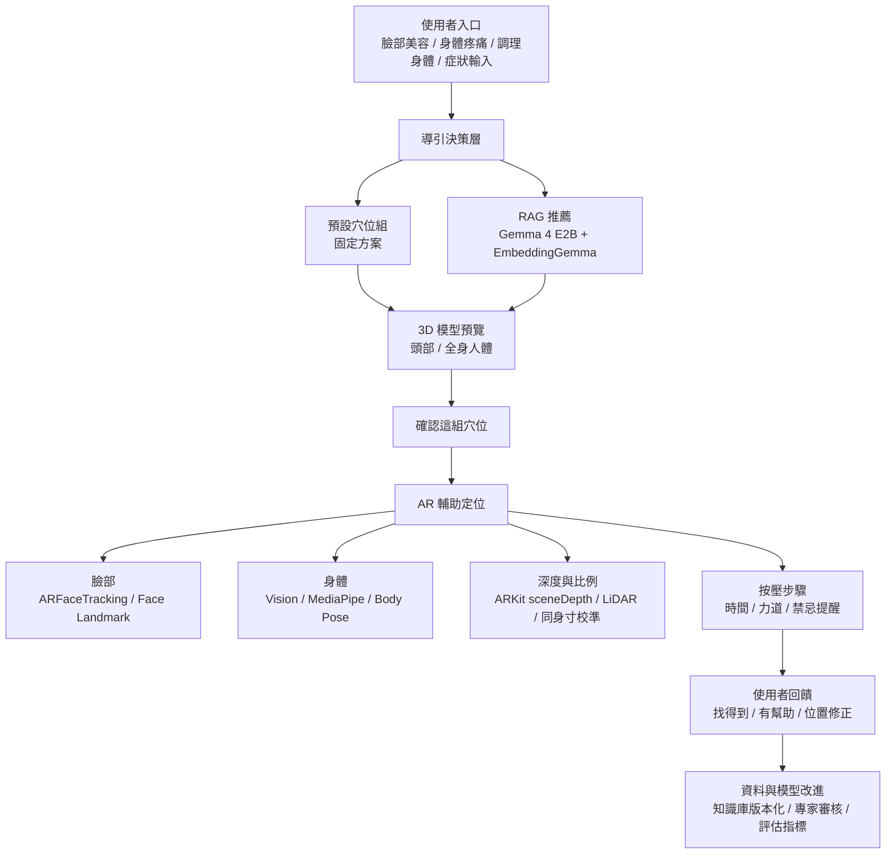
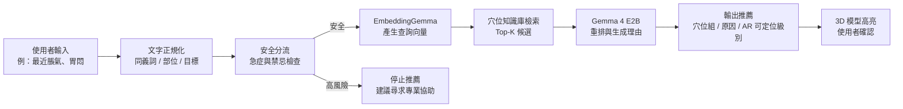
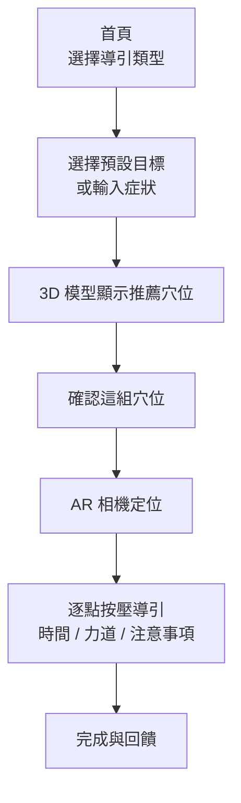

# AcuGuide：個人化 AR 穴位導引與自我照護 App 企劃書初版

> 版本：v0.1  
> 日期：2026-05-26  
> 目標平台：iOS App  
> 目前原型：Web Demo（React / Vite / Three.js / MediaPipe / Gemma Web）  
> 定位：以「非侵入式穴位按壓與自我照護教育」為主，不提供疾病診斷、針刺治療或取代醫療建議。

---

## 可先放的圖與圖表建議

這一段可以先放在企劃書前面給 Claude 或設計同學參考，正式送件時可移到「伍、初步 App 介面與操作說明」或附錄。

| 圖號 | 圖名 | 建議內容 | 來源 / 製作方式 |
|---|---|---|---|
| 圖 1 | AcuGuide 使用情境圖 | 使用者輸入「眼皮浮腫 / 肩頸痠痛 / 脹氣」，App 推薦穴位並以 AR 標示 | 可用 Figma 做三格情境圖，或用目前 Web Demo 截圖拼接 |
| 圖 2 | 目前 Web Demo 首頁 | 三大導引類型：臉部美容、身體部位疼痛、調理身體；右側 3D 模型預覽 | 直接截圖 `http://127.0.0.1:5173/` |
| 圖 3 | 3D 模型確認畫面 | 右側 3D 頭部 / 全身模型亮點，底部「確認這組穴位」 | Web Demo 截圖 |
| 圖 4 | AR 輔助定位畫面 | 相機畫面為主，3D 模型縮小作參考，穴位疊在臉或身體對應區域 | Web Demo 截圖或 Figma mockup |
| 圖 5 | 系統架構圖 | iOS UI、RAG、Gemma 4 E2B、EmbeddingGemma、ARKit / Vision、資料庫與回饋管線 | 使用本文 Mermaid 架構圖轉成圖片 |
| 圖 6 | RAG 推薦流程圖 | 使用者輸入症狀 → 安全分流 → 向量檢索 → LLM 生成推薦 → 3D/AR 顯示 | 使用本文 Mermaid 流程圖 |
| 圖 7 | 穴位定位信心分級 | A：可由臉部 landmark 精準定位；B：可由骨點估算；C：需寸法；D：僅文字參考 | Figma 或簡單表格 |
| 圖 8 | iOS 深度感測策略 | 前鏡頭 TrueDepth 用於臉部；後鏡頭 LiDAR / sceneDepth 用於身體與空間距離 | 可畫前後鏡頭對照圖 |
| 圖 9 | 資料庫 schema / 知識圖譜 | 穴位、經絡、症狀、功效、禁忌、AR 定位策略、來源 | 使用資料表或 knowledge graph 圖 |
| 圖 10 | 未來發展路線圖 | Demo → iOS MVP → 專家驗證 → 個人化校準 → 上架 / 研究合作 | 時程圖 |

---

## 摘要

AcuGuide 是一款結合 3D 模型、AR 即時定位、個人化寸法校準與本地端 LLM / RAG 推薦的穴位自我照護 App。使用者可以先從「臉部美容」、「身體部位疼痛」、「調理身體」三大情境進入，選擇如改善眼皮浮腫、瘦小臉、肩頸痠痛、脹氣腹脹等常見目標；若使用者只知道自己不舒服但不確定該選哪一項，也能在底部輸入症狀，由 Gemma 4 E2B 搭配 EmbeddingGemma 建立的穴位知識庫推薦合適穴位。

App 的核心不是單純列出穴位圖解，而是把「知道要按哪裡」推進到「看得懂、找得到、按得安全」。使用者會先在 3D 頭部或人體模型上看到推薦穴位的位置，確認後進入 AR 輔助畫面；臉部以 Face Tracking / Face Landmark 為主，身體以 Body Pose、手部 landmark、ARKit depth / LiDAR 或必要時的寸法校準作為輔助。系統同時提供定位信心分級、安全提醒與使用者回饋，讓穴位資料、AR 定位與推薦模型能逐步形成可驗證、可改進的閉環。

---

## 壹、痛點陳述與目標

### 一、痛點陳述

現代人長時間使用手機與電腦，久坐、低頭、眼睛疲勞、肩頸緊繃、睡眠不足與腸胃不適已成為日常生活中常見的身體困擾。許多人會透過網路文章、穴位圖解 App、影片教學或中醫書籍查詢穴位，希望用簡單的按壓方式進行日常保養與自我舒緩。然而，現有工具大多仍停留在「查得到資料」的階段，使用者即使知道某個症狀可能對應哪些穴位，仍必須自行理解文字描述、對照靜態圖片，再把穴位位置轉換到自己的臉部或身體上。

傳統穴位資料常以專業定位語句呈現，例如「目內眥旁 0.1 寸」、「膝下 3 寸」、「第二腰椎棘突下旁開 1.5 寸」等。這些描述對受過中醫、針灸或解剖訓練的人具有明確意義，但對一般使用者來說並不直覺。使用者常會遇到三個落差：第一，是文字位置與自身身體之間的落差；第二，是平面圖像與立體身體曲面之間的落差；第三，是標準穴位描述與個人體型比例之間的落差。也就是說，使用者並不是完全缺乏穴位資訊，而是缺少一個能把資訊轉換成「自己身上實際位置」的導引工具。

舊有方法通常仰賴靜態穴位圖、經絡分類、症狀查詢或影片示範。這些方式雖然能提供知識，但使用者仍需要自行判斷穴位所在位置，尤其在眼周、鼻翼、顴骨、肩頸、腰背、膝腿等部位時，些微位置偏差就可能讓按壓效果降低，甚至造成不適。以臉部美容為例，使用者想改善眼皮浮腫或法令紋時，常會看到「睛明」、「攢竹」、「四白」、「迎香」等穴位名稱，但眼周與鼻翼附近屬於較敏感區域，如果只靠圖片與文字判斷，容易產生按錯位置、力道過大或忽略禁忌的問題。以身體部位疼痛為例，肩頸與腰背常需要辨認骨點與肌肉位置，使用者自己透過鏡子或手機畫面對照時，操作並不方便。以腸胃或疲勞調理為例，使用者可能只知道自己「脹氣」、「胃悶」、「很累」，但不一定知道該查哪一個穴位、哪一條經絡，或哪些情況其實不適合自行按壓。

此外，傳統穴位定位常使用「同身寸」概念，也就是依照個人身體比例估算距離，而不是直接套用固定公分數。這使得穴位定位具有高度個人化特性。不同使用者的臉型、身高、手掌寬度、腿長、鏡頭距離與拍攝角度都可能影響判斷結果。若 App 只提供固定位置或固定圖示，便很難真正符合每個人的身體比例。若系統沒有即時影像輔助，也無法知道使用者目前是否對準正確部位、是否需要轉換角度、是否因遮擋或姿勢造成定位不穩定。

安全性也是現有工具較少完整處理的問題。穴位按壓雖屬非侵入式自我照護，但仍涉及眼周、頸部、腹部、孕期、皮膚破損、急性疼痛等情境。如果使用者只依照網路資訊自行嘗試，可能忽略需要就醫或不適合按壓的狀況。因此，本作品面對的核心痛點並不是「市面上沒有穴位資料」，而是現有方式缺少即時定位、個人化比例、安全分流與情境化推薦，導致一般使用者從「知道穴位名稱」到「正確、安全地找到位置」之間仍存在明顯斷層。

### 二、目標使用者

本作品的目標使用者為希望進行日常自我照護，但缺乏中醫穴位定位經驗的一般大眾。對學生與上班族而言，長時間讀書、辦公、使用螢幕與低頭滑手機，容易造成眼睛疲勞、肩頸痠痛與精神緊繃，他們需要的是能快速理解、快速操作，並且不需要先具備專業經絡知識的工具。對美容保養需求者而言，眼皮浮腫、黑眼圈、蘋果肌、法令紋與小臉按摩等需求多集中在臉部細緻區域，因此更需要即時視覺化輔助，幫助使用者避開眼球、傷口或過度施力的位置。

對運動者、久站族群或身體容易緊繃的人來說，膝腿不適、腰背緊繃與肩頸痠痛可能與姿勢、疲勞或局部肌肉緊張有關。這類使用者不一定想查完整經絡理論，而是希望 App 可以根據不舒服的部位提供初步按壓建議，並透過 3D 模型或 AR 畫面提醒應該對準哪個區域。對腸胃不適、脹氣、消化不順或精神疲勞的使用者而言，他們通常是以症狀描述開始，例如「飯後很脹」、「胃悶」、「最近很累」，因此需要系統能把自然語言輸入轉換為可能適合的穴位組合，而不是要求使用者先知道穴位名稱。

整體而言，AcuGuide 面向的是「想嘗試穴位自我照護，但不知道如何正確開始」的人。作品希望降低穴位學習門檻，讓沒有中醫背景的使用者也能透過情境選擇、3D 模型預覽與 AR 輔助定位，逐步理解穴位位置與按壓方式。同時，系統也需在必要時提醒使用者停止自行操作並尋求專業協助，避免將自我保養誤用為醫療診斷或治療。

### 三、作品目標

本作品以「個人化 AR 穴位導引與自我照護學習」為主題，目標是開發一套 iOS App，將傳統穴位資料、情境化推薦、3D 模型預覽、即時影像辨識與 AR 輔助定位整合在同一個操作流程中。AcuGuide 不只是提供穴位名稱與功效，而是希望協助使用者完成從「描述需求」到「確認穴位」再到「定位按壓」的完整過程。

在操作設計上，App 會先以臉部美容、身體部位疼痛與調理身體三大入口降低使用門檻。當使用者已有明確需求，例如改善眼皮浮腫、淡化法令紋、肩頸痠痛或脹氣腹脹時，系統可直接提供預設穴位組，避免每次都依賴語言模型生成答案。當使用者只知道自己不舒服，卻不確定應該選哪個分類或穴位時，系統再透過本地端 Gemma 4 E2B 搭配 RAG 穴位知識庫進行推薦，將自然語言症狀轉換成可理解、可追溯的穴位建議。

在定位設計上，App 會先透過 3D 頭部模型或全身人體模型展示推薦穴位，讓使用者在開啟相機前先理解大致位置。確認後，使用者進入 AR 指引畫面，系統再以臉部 landmark、身體姿態偵測、手部 landmark、ARKit depth 或 LiDAR 深度資訊輔助定位，將穴位提示疊加在使用者自己的臉部或身體畫面上。對於能由穩定特徵點推估的位置，系統可直接提供 AR 標記；對於需要同身寸或個人比例換算的位置，則在必要時才啟用校準流程，避免讓使用者一開始就被複雜設定中斷。

本作品也將「定位信心」與「安全分流」納入設計目標。不同穴位因所在部位與偵測條件不同，AR 定位精度不應被視為完全相同，因此系統會依據可偵測 landmark、是否需要寸法、是否需要深度資訊等條件，對穴位定位能力進行分級。若遇到急性疼痛、眼部異常、呼吸困難、突發麻木、孕期高風險、皮膚破損或其他不適合自行按壓的狀況，App 應明確提示停止使用並尋求專業醫療協助。

綜合而言，AcuGuide 的目標不是取代中醫師或醫療判斷，而是建立一個安全、直覺、具互動性的穴位自我照護輔助工具。它將舊有的圖文查詢方式轉化為情境化、視覺化與個人化的操作體驗，讓使用者能在理解風險與限制的前提下，更容易找到適合的穴位位置，並逐步累積正確的自我照護知識。

---

## 貳、作品構想與特色

### 一、核心概念

AcuGuide 將傳統穴位查詢從「資料庫」升級成「互動式導引」。使用者不是先背經絡名稱，而是從自己的目標出發：

- 我想改善眼皮浮腫。
- 我想讓臉看起來比較緊緻。
- 我肩頸很痠，但不知道按哪裡。
- 我最近脹氣、消化不順。

系統會先依照固定方案或 RAG 推薦產生一組穴位，再用 3D 模型讓使用者理解位置，最後進入 AR 畫面進行輔助定位。整體流程強調「先理解、再確認、最後定位」。

### 二、三大導引類型

| 類型 | 預設目標 | 範例穴位 | 定位策略 |
|---|---|---|---|
| 臉部美容 | 改善眼皮浮腫、蘋果肌澎潤、瘦小臉、淡化法令紋 | 睛明、攢竹、四白、顴髎、迎香、下關 | Face Landmark / ARFaceTracking / 3D 頭部模型 |
| 身體部位疼痛 | 肩頸痠痛、腰背緊繃、膝腿不適 | 風池、肩井、合谷、腎俞、委中、足三里、血海 | Body Pose / 後鏡頭 AR / LiDAR 輔助 |
| 調理身體 | 脹氣腹脹、消化不順、精神疲勞 | 中脘、天樞、關元、內關、足三里、三陰交、百會 | 身體 landmark + 寸法校準 + 安全提醒 |

### 三、創新特色

1. **AR 導引不是裝飾，而是主要操作介面**  
   App 的穴位指引頁以相機畫面為主，3D 模型只作為輔助參考。使用者看到的是自己的臉或身體，而不是只看一張固定圖。

2. **固定方案與 LLM 推薦分工清楚**  
   「改善眼皮浮腫」、「瘦小臉」等明確情境使用預先設定的穴位組；只有使用者輸入模糊症狀或不知道如何選擇時，才啟用 Gemma 4 E2B + RAG。這樣可以降低 LLM 幻覺風險，也讓體驗更穩定。

3. **穴位定位信心分級**  
   每個穴位都不只存名稱與功效，也會標註 AR 可定位程度：
   - A 級：可由穩定 landmark 直接定位，例如眼角、眉頭、鼻翼旁。
   - B 級：可由骨點或身體關節估算，例如膝下、小腿、手背。
   - C 級：需要同身寸或深度資訊輔助，例如腹部、背部。
   - D 級：第一版只提供 3D / 文字參考，不直接疊 AR 點。

4. **個人化寸法採按需啟用**  
   傳統手部比例尺校準會受手掌到鏡頭距離影響，因此第一版不把它設為必經流程。進入 AR 後，若某穴位需要「3 寸」、「1.5 寸」等距離，才提示使用者進行局部校準。未來 iOS 版可結合 ARKit sceneDepth、LiDAR 或 TrueDepth 降低誤差。

5. **本地端 LLM 與 RAG 保護隱私**  
   預計使用 Gemma 4 E2B 作為本地端語言模型，EmbeddingGemma 建立穴位資料向量索引，讓症狀輸入、臉部影像、身體姿態與推薦過程優先在裝置端完成。

6. **安全與教育並重**  
   App 不宣稱治療疾病，而是提供自我照護、穴位知識學習與按摩導引。對於急性胸痛、呼吸困難、突發麻木無力、劇烈疼痛、眼部異常、皮膚感染、懷孕高風險等情境，系統應明確提示停止使用並尋求醫療協助。

---

## 參、與市場現有 App 比較

| App 名稱 | 功能敘述 | 目標受眾 | 功能差異 |
|---|---|---|---|
| Acupoint — AR 穴位即時定位按摩指南 | 使用前置鏡頭標記臉部穴位，提供臉部按摩與收藏功能。 | 想學習臉部穴位、美顏按摩與眼疲勞舒緩的使用者。 | 優勢是臉部 AR 定位直覺，但主要集中在臉部穴位，缺少多部位身體定位、個人化寸法校準與 LLM 症狀推薦。 |
| 人體穴位圖解 | 提供穴位圖解、經絡分類、穴位按摩、對症查詢與穴位圖表。 | 想查詢穴位資料與學習經絡知識的使用者。 | 資料查詢完整，但使用者仍需自行對照身體位置，缺少 AR 即時導引、3D 模型預覽與定位信心分級。 |
| AcuApp® Akupressur | 依症狀推薦按壓點，提供照片、插圖、位置描述與按摩說明。 | 想依照不適症狀進行自我按壓的人。 | 優勢是症狀導向與內容說明，但缺少即時鏡頭定位、個人化比例校準與本地端 RAG 知識更新。 |
| CloudTCM 雲端中醫穴位資料庫 | 提供經絡穴道資料庫、穴位位置、功效、經絡與主治分類。 | 想查詢中醫資料、穴位與經絡資訊的使用者。 | 資料量豐富，適合作為知識來源參考，但本作品需確認授權後才能建立自有 RAG 資料庫；AcuGuide 的差異在於 AR 定位、3D 模型、App 流程與個人化導引。 |
| AcuGuide | 以情境瀏覽為入口，整合 3D 模型、AR 輔助定位、個人化寸法、Gemma 4 E2B + EmbeddingGemma RAG、定位信心分級與使用者回饋。 | 學生、上班族、運動者、養顏美容需求者與一般自我照護使用者。 | 特色是把「查詢穴位」轉為「推薦、預覽、確認、AR 定位、回饋」的完整流程，並以本地端模型與安全分流降低隱私與錯誤建議風險。 |

---

## 肆、架構與關鍵功能

### 一、整體系統架構

### 二、iOS 技術架構規劃

| 層級 | 技術 | 用途 |
|---|---|---|
| App UI | SwiftUI | 建立首頁、導引卡片、3D 預覽、AR 指引頁、回饋頁 |
| 3D 顯示 | RealityKit / SceneKit | 顯示頭部與全身人體模型、穴位高亮、模型旋轉與確認 |
| AR 臉部 | ARKit `ARFaceTrackingConfiguration` | 前鏡頭臉部追蹤、臉部 mesh、臉部穴位 AR 疊加 |
| AR 身體 | ARKit `ARWorldTrackingConfiguration` + Vision / MediaPipe | 後鏡頭世界追蹤、身體骨架、關節定位、部位估算 |
| 深度感測 | LiDAR `sceneDepth` / `smoothedSceneDepth` | 支援具 LiDAR 的 iPhone / iPad 進行距離與表面深度估算 |
| 手部 / 身體 landmark | Vision / MediaPipe Tasks | 偵測手、臉、身體關鍵點，供寸法與 AR 定位使用 |
| 本地端 LLM | Gemma 4 E2B | 將使用者症狀轉成可解釋的穴位推薦 |
| RAG Embedding | EmbeddingGemma | 將穴位資料、症狀、功效、禁忌、定位描述轉為向量檢索 |
| 本機資料庫 | SQLite / SwiftData / local vector index | 儲存穴位資料、RAG 索引、使用者收藏與非敏感回饋 |
| 安全規則 | Rule-based safety layer | 在 LLM 前後檢查危險症狀、禁忌、不可自行按壓情境 |

### 三、RAG 推薦流程

### 四、穴位資料庫欄位設計

| 欄位 | 說明 |
|---|---|
| `id` | 系統內部唯一代碼 |
| `name_zh` | 中文穴位名，例如「睛明」 |
| `code` | 國際常用代碼，例如 ST36、LI4、GV20 |
| `meridian` | 所屬經絡 |
| `location_text` | 傳統定位描述 |
| `body_region` | 臉、頭頸、手、腹、背、腿等 |
| `effects` | 常見功效 / 自我照護目標 |
| `indications` | 主治或相關症狀文字，需標示來源 |
| `contraindications` | 禁忌與注意事項 |
| `preset_tags` | 對應 App 情境，例如眼皮浮腫、肩頸痠痛 |
| `ar_confidence` | A / B / C / D 定位信心 |
| `detector` | face / hand / pose / depth / manual |
| `landmark_indices` | 可對應 MediaPipe / Vision / ARKit 的 landmark index |
| `cun_rule` | 若需同身寸，記錄距離規則 |
| `source` | 資料來源與授權狀態 |
| `review_status` | demo / reviewed / expert_verified |

### 五、關鍵功能

#### 1. 導引類型選擇

首頁以三大卡片呈現「臉部美容」、「身體部位疼痛」、「調理身體」。每個卡片下方列出預設目標，滑鼠或手指停留時，右側 3D 模型會高亮該目標對應穴位。點擊目標後，模型停止自動旋轉並以最近角度把穴位轉到視覺中心，使用者再按「確認這組穴位」。

#### 2. 症狀輸入與 LLM 推薦

底部輸入框保留給「沒有合適預設選項」的情境。例如使用者輸入「胃悶、脹氣、最近精神很累」，系統會先透過安全規則過濾，再用 RAG 找到候選穴位，最後由 Gemma 4 E2B 產生推薦順序與簡短理由。LLM 不直接控制 AR 座標，而是只能從知識庫候選中選擇，降低生成錯誤穴位的風險。

#### 3. 3D 模型預覽

臉部美容使用頭部模型；身體部位疼痛與調理身體使用全身人體模型。模型上以小型發光點標示推薦穴位，並可依不同目標轉到最容易理解的角度。3D 預覽的目的不是取代 AR，而是在使用者開相機前先建立空間理解。

#### 4. AR 輔助定位

進入穴位指引後，相機畫面成為主要介面。臉部穴位以 Face Landmark 對應眼角、眉頭、鼻翼、顴骨等區域；身體穴位以肩、肘、腕、髖、膝、踝等關鍵點估算。若裝置支援 LiDAR，可使用 `sceneDepth` / `smoothedSceneDepth` 增加距離與表面貼合能力。若不支援，則以 landmark 與同身寸校準作輔助。

#### 5. 按需個人化校準

手部比例尺校正不作為第一步必經流程。原因是單純用 2D 相機偵測手掌寬度會受到手掌到鏡頭距離影響。合理做法是：

1. A 級臉部穴位：直接定位，不校準。
2. B 級身體穴位：以關節 landmark 估算，不強制校準。
3. C 級寸法穴位：進入 AR 後提示「需要校準 1 寸」，使用手部 landmark 或 LiDAR 深度做局部換算。
4. D 級穴位：只提供 3D 模型、文字與安全提醒，不直接給 AR 點。

#### 6. 安全分流與禁忌提醒

安全規則應獨立於 LLM，且優先級最高。若使用者輸入以下情境，App 不推薦穴位：

- 胸痛、呼吸困難、昏厥、突發單側無力或麻木。
- 劇烈頭痛、視力突然變化、眼部外傷或感染。
- 高燒、急性腹痛、外傷、骨折疑慮。
- 懷孕、出血傾向、使用抗凝血藥物、皮膚感染或傷口部位。
- 使用者表示症狀持續惡化或已影響日常功能。

#### 7. 回饋與持續學習

每次導引結束後，使用者可回饋：

- 是否找得到位置。
- AR 點是否貼近實際部位。
- 按壓後是否感覺舒緩。
- 是否需要收藏或下次提醒。

這些回饋不直接自動修改醫療知識，而是形成待審核資料，用於改善 UI、定位策略與推薦排序。

---

## 伍、初步 App 介面與操作說明

### 一、主要操作流程

### 二、畫面 1：導引類型選擇

首頁左側為三大導引類型，右側為 3D 模型預覽，底部為症狀輸入框。使用者選到「臉部美容」時，右側只預覽臉部相關穴位；滑到「身體部位疼痛」或「調理身體」的其他細項，不會自動切換模型，除非使用者真的點選該類型。此設計可避免使用者在瀏覽時被不必要的模型切換干擾。

可放圖：目前 Web Demo 首頁截圖，標註三大區塊。

### 三、畫面 2：3D 模型確認

當使用者選擇「淡化法令紋」或由 RAG 推薦出「顴髎、四白、迎香」後，3D 模型會高亮穴位點，右上角顯示推薦摘要，模型區下方提供「確認這組穴位」。所有預設方案與 LLM 推薦都統一在模型上確認，避免每個細項旁邊都出現確認按鈕造成介面混亂。

可放圖：3D 頭部模型高亮臉部穴位截圖；全身模型高亮肩頸或膝腿穴位截圖。

### 四、畫面 3：AR 輔助定位

穴位指引頁以相機畫面為主。若是臉部穴位，使用前鏡頭定位眼角、眉頭、鼻翼等；若是身體穴位，使用後鏡頭對準肩頸、腰背、膝腿等區域。右下角或側邊可放縮小版 3D 模型作為參考，使用者可在 AR 畫面中看到目前要按的穴位、下一個穴位與定位信心。

可放圖：AR 主畫面 mockup，標示「相機畫面」、「穴位點」、「信心等級」、「下一穴位」。

### 五、畫面 4：按需校準

當系統判定當前穴位需要同身寸，例如「膝下 3 寸」、「臍下 3 寸」時，才顯示校準提示。校準可以是：

- 手指寬度校準：以 MediaPipe / Vision 偵測手部 landmark，估算手指寬度。
- LiDAR 深度校準：支援裝置可直接利用深度資訊估計身體表面距離。
- 手動微調：使用者拖曳 AR 點到感覺正確的位置，系統記錄偏移作為個人化參考。

可放圖：手部 landmark 對應「一寸」的示意圖，並註明此頁不是必經流程。

### 六、畫面 5：完成與回饋

導引完成後，App 顯示本次按壓穴位、按壓時間、注意事項與回饋選項。回饋資料用於改善定位與推薦，不做醫療結論。

可放圖：完成頁與回饋 UI。

---

## 陸、未來發展及永續影響

### 一、開發時程規劃

| 階段 | 時間 | 目標 |
|---|---|---|
| Phase 0：Web Demo | 已完成初版 | 三大模式、3D 模型、MediaPipe landmark、Gemma Web 推薦、AR 指引原型 |
| Phase 1：iOS MVP | 4-6 週 | SwiftUI 介面、3D 模型預覽、預設穴位組、臉部 AR 定位 |
| Phase 2：身體 AR 與按需校準 | 6-8 週 | 後鏡頭 body pose、LiDAR depth 支援、手部寸法校準、定位信心分級 |
| Phase 3：RAG 與安全規則 | 4-6 週 | EmbeddingGemma 索引、Gemma 4 E2B 推薦、安全分流、資料來源版本管理 |
| Phase 4：使用者測試 | 4 週 | 10-30 位使用者可用性測試、AR 定位穩定度、推薦滿意度 |
| Phase 5：專家審核與上架準備 | 6 週以上 | 中醫 / 物理治療 / 醫療安全顧問審核、隱私政策、App Store 審查準備 |

### 二、可量化評估指標

| 指標 | 說明 |
|---|---|
| 穴位推薦命中率 | 與專家標註或預設方案比對，推薦 Top-3 是否合理 |
| AR 定位穩定度 | 穴位點在相機畫面中的抖動程度與遺失率 |
| 定位可理解度 | 使用者是否能在 30 秒內找到目標位置 |
| 任務完成率 | 使用者能否從選目標到完成按壓 |
| 安全分流正確率 | 危險症狀是否能被阻擋 |
| 本地推論延遲 | Gemma / embedding / AR 模型在 iPhone 上的回應時間 |
| 隱私保護比例 | 有多少功能可在離線或本機完成 |

### 三、未來擴充方向

1. **穴位資料擴充與授權管理**  
   可參考 CloudTCM、WHO 標準穴位位置、公開中醫資料與專家審核資料，但正式商用或公開資料庫前，需確認資料授權與引用方式。CloudTCM 頁面可作為研究參考，不建議未授權大量爬取後直接商用。

2. **專家審核機制**  
   將穴位資料分成 demo、已整理、專家審核、臨床合作四個等級，避免未驗證資料直接影響推薦。

3. **個人化定位模型**  
   透過使用者微調 AR 點、身高、手指寬、左右側習慣，建立個人化偏移參數。

4. **更完整的 iOS 感測整合**  
   臉部使用 TrueDepth / ARFaceTracking；身體使用後置鏡頭、LiDAR sceneDepth 與 Vision 3D body pose。無 LiDAR 裝置則降級為 landmark + 手動校準。

5. **多語系與教育模式**  
   未來可加入繁中、英文、日文，並提供「學習模式」讓使用者認識經絡與穴位，不只完成一次按壓。

### 四、永續影響與 SDG 對應

| SDG | 對應說明 |
|---|---|
| SDG 3 健康與福祉 | 以低門檻方式提供自我照護教育，協助使用者建立身體覺察與日常舒緩習慣。 |
| SDG 4 優質教育 | 將抽象穴位知識轉為 3D / AR 可視化學習，降低傳統知識學習門檻。 |
| SDG 9 產業創新與基礎建設 | 結合 on-device AI、ARKit、RAG 與個人化感測，形成新型態健康科技應用。 |
| SDG 10 減少不平等 | 讓沒有中醫背景的一般使用者也能理解穴位定位，但同時保留安全提醒與專業分流。 |

---

## 柒、其他：引用資料、授權與注意事項

### 一、目前 Web Demo 已具備的基礎

- React + TypeScript + Vite 前端架構。
- Three.js 頭部與全身 3D 模型預覽。
- MediaPipe Tasks Vision：Pose Landmarker、Face Landmarker、Hand Landmarker。
- MediaPipe Tasks GenAI：Gemma Web 任務雛形。
- 三大導引類型與多組預設目標。
- 穴位資料庫包含位置、功效、標籤、3D 座標與 AR 定位信心。
- AR 指引頁已以相機畫面為主，3D 模型為輔助。

### 二、資料來源與引用策略

1. 穴位標準位置可參考 WHO Standard Acupuncture Point Locations in the Western Pacific Region。
2. CloudTCM 提供豐富穴位資料、功效分類與主治分類，但其服務條款包含著作權限制，若要建立資料庫應先確認授權或只作研究參考。
3. 使用者提供的美容穴位清單可先作 Demo 資料，正式版本需補來源與專家審核。
4. 3D 模型若來自 Sketchfab，需在 App 與企劃書標示作者、授權條款與連結。
5. App 內所有建議須標註「自我照護參考，不取代醫師、合格中醫師或其他醫療專業人員建議」。

### 三、參考連結

- Apple Developer Documentation：ARFaceTrackingConfiguration  
  https://developer.apple.com/documentation/arkit/arfacetrackingconfiguration/

- Apple Developer Documentation：Tracking and visualizing faces  
  https://developer.apple.com/documentation/arkit/tracking-and-visualizing-faces

- Apple Developer Documentation：sceneDepth / smoothedSceneDepth  
  https://developer.apple.com/documentation/arkit/arconfiguration/framesemantics-swift.struct/scenedepth  
  https://developer.apple.com/documentation/arkit/arconfiguration/framesemantics-swift.struct/smoothedscenedepth

- Apple Developer Documentation：Visualizing and interacting with a reconstructed scene  
  https://developer.apple.com/documentation/arkit/arkit_in_ios/camera_lighting_and_effects/visualizing_and_interacting_with_a_reconstructed_scene/

- Apple Developer Documentation：Vision 3D Human Body Pose  
  https://developer.apple.com/documentation/vision/identifying-3d-human-body-poses-in-images

- Google AI Edge：MediaPipe Pose Landmarker  
  https://ai.google.dev/edge/mediapipe/solutions/vision/pose_landmarker

- Google AI for Developers：EmbeddingGemma  
  https://ai.google.dev/gemma/docs/embeddinggemma

- Google Gemma docs  
  https://ai.google.dev/gemma/docs/core?hl=zh-tw

- Gemma 4 E2B model card  
  https://huggingface.co/google/gemma-4-E2B

- CloudTCM 穴位資料庫  
  https://cloudtcm.com/acupoint

- CloudTCM 服務條款與著作權聲明  
  https://cloudtcm.com/cmas/agreement

- WHO standard acupuncture point locations in the Western Pacific region  
  https://iris.who.int/handle/10665/353407

- NCCIH：Acupuncture Effectiveness and Safety  
  https://www.nccih.nih.gov/health/acupuncture-in-depth

- App Store：Acupoint — AR 穴位即時定位按摩指南  
  https://apps.apple.com/au/app/acupoint/id6499210069

- App Store：人體穴位圖解  
  https://apps.apple.com/tw/app/%E4%BA%BA%E9%AB%94%E7%A9%B4%E4%BD%8D%E5%9C%96%E8%A7%A3/id1663133924

- AcuApp 官方網站  
  https://acu-app.com/en/acu-app-com/

---

## 給 Claude 的檢查提示

請幫我把這份 AcuGuide iOS App 企劃書強化成比賽可提交版本，重點檢查：

1. 是否每個章節都有比賽企劃書需要的完整性。
2. 是否能更清楚凸顯創新性：AR、3D 模型、Gemma 4 E2B、EmbeddingGemma、RAG、個人化寸法、定位信心分級。
3. 市場比較是否足夠有說服力，是否需要補更多競品。
4. 技術架構是否表達得專業但不過度承諾。
5. 醫療安全與隱私風險是否寫得足夠嚴謹。
6. 哪些地方適合補圖、補流程圖、補 UI mockup 或補實驗數據。
7. 語氣是否像正式企劃書，而不是一般產品介紹。
